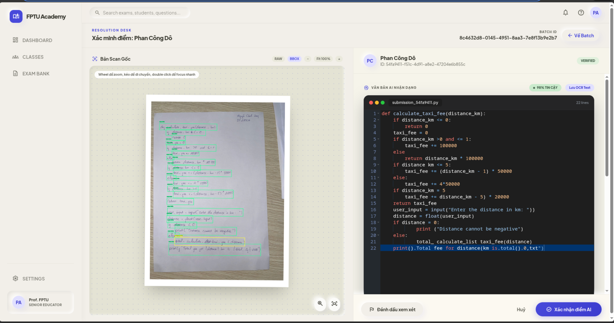
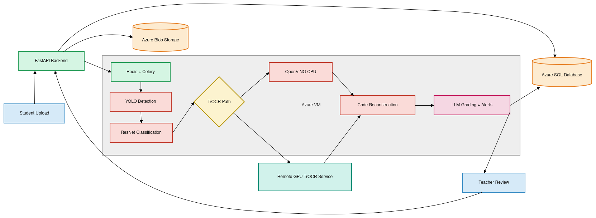
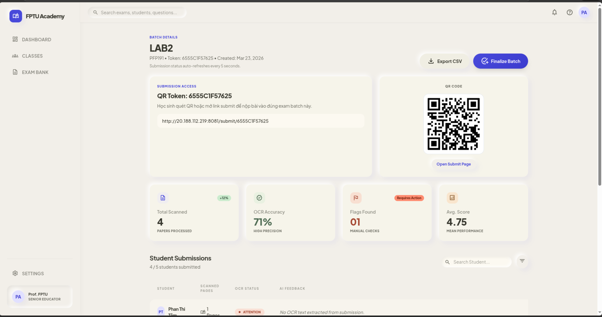
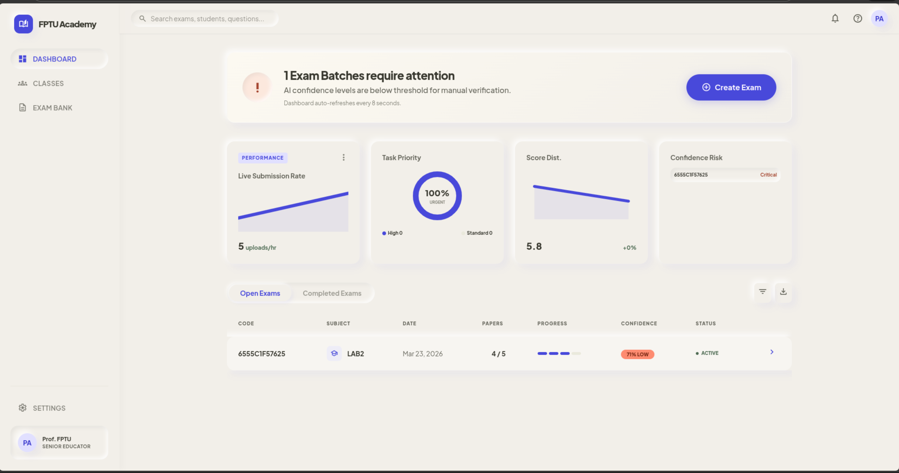

# EXAM_OCR

Handwritten code OCR for academic exam sheets, built as a deployable system rather than a notebook-only prototype.

This project detects handwritten code lines, filters unusable regions, recognizes code text, reconstructs indentation-sensitive output, and supports asynchronous submission processing with review and grading workflows.

## Why This Project

Recognizing handwritten code is harder than normal OCR:

- programming syntax is brittle
- characters such as `1`, `l`, `i`, `(`, `{`, and `[` are easy to confuse
- Python indentation carries semantics
- exam sheets are noisy, inconsistent, and written under time pressure

`EXAM_OCR` tackles this with a hybrid pipeline:

- `YOLO` for line detection
- `ResNet18` for line-status classification (`clean`, `ambiguous`, `crossed`)
- `TrOCR` for handwritten text recognition
- indentation-aware post-processing for code reconstruction

It also includes a real application stack:

- `FastAPI` backend
- `Celery + Redis` for background OCR jobs
- `Azure SQL` for exam/submission metadata
- `Azure Blob Storage` for images and OCR artifacts
- `frontend-v2` for submission and teacher review workflows



## Project Highlights

- End-to-end OCR pipeline for handwritten code exam sheets
- Hardware-aware optimization for both CPU and GPU deployment
- OpenVINO integration for the best CPU path
- CUDA FP16 path for the strongest stable GPU acceleration
- Asynchronous architecture suitable for real submissions
- Teacher-in-the-loop review and AI re-evaluation workflow

## How It Works

The OCR flow is:

1. Upload an exam-sheet image.
2. Detect handwritten code lines with YOLO.
3. Classify each crop with ResNet18.
4. Remove `crossed` lines before OCR.
5. Recognize valid lines with TrOCR.
6. Recover indentation structure from line geometry.
7. Return reconstructed code and optional visualization.

This separation is important: line detection, filtering, recognition, and reconstruction are different problems and benefit from different models.



## Performance Snapshot

These are the current headline results used in the project:

### Full pipeline CPU

| Mode | Avg. Pipeline Time | Notes |
|---|---:|---|
| Baseline PyTorch | `~91.0s` | original reference pipeline |
| Optimized PyTorch | `~81.7s` | reduced overhead on the hot path |
| ONNX CPU | `~87.4s` | not better than optimized PyTorch |
| OpenVINO CPU | `~23.4s` | best CPU path |

### TrOCR quality

| Runtime | Device | Mean CER | Median CER | Exact Match |
|---|---|---:|---:|---:|
| PyTorch | CPU | `0.240490` | `0.166667` | `27.01%` |
| OpenVINO | CPU | `0.240490` | `0.166667` | `27.01%` |
| PyTorch | CUDA fp16 | `0.2410` | `0.1667` | `27.01%` |

### ResNet classifier

| Runtime | Accuracy | Avg. Time / Image | Throughput |
|---|---:|---:|---:|
| PyTorch | `79.02%` | `3.570 ms` | `280.09 img/s` |
| OpenVINO | `79.02%` | `3.124 ms` | `320.14 img/s` |

### Best runtime per hardware target

- `CPU`: OpenVINO
- `GPU`: PyTorch CUDA FP16

For more details, see [BENCHMARK_RESULTS.md](BENCHMARK_RESULTS.md) and [documents/PRESENTATION_REPORT_GUIDE.md](documents/PRESENTATION_REPORT_GUIDE.md).

## Architecture

This repository contains both model experimentation artifacts and a deployable application stack.

### Core components

| Layer | Stack | Responsibility |
|---|---|---|
| Frontend | `frontend-v2` | student submission, teacher review, grading views |
| Legacy demo UI | `frontend` | older Streamlit-based OCR/grading demo |
| API | FastAPI | OCR orchestration, submission APIs, grading APIs |
| Background jobs | Celery + Redis | asynchronous OCR processing |
| OCR models | YOLO + ResNet18 + TrOCR | detection, filtering, recognition |
| Storage | Azure Blob | uploaded images and visualization outputs |
| Database | Azure SQL | exams, submissions, pages, answers, grades |
| Optional remote inference | GPU service | remote TrOCR path for GPU-backed deployments |

### Why Celery + Redis?

OCR is compute-heavy and slow relative to a normal web request. Instead of making the frontend wait for a full OCR pass, the backend stores the submission, enqueues a job, and lets workers process it in the background. This improves responsiveness, isolates OCR failures from request-serving, and scales better when many students submit at once.

If you have a proper architecture diagram later, this is the best place to insert it.

## Current Product Surface

The project currently exposes two UI layers:

- [`frontend-v2`](frontend-v2): the main product UI for exam submission and teacher review
- [`frontend`](frontend): a legacy Streamlit demo client

The backend lives in [`backend/app`](backend/app) and provides:

- OCR prediction endpoints
- readiness and health endpoints
- submission and review endpoints
- grading and AI re-evaluation flows

### UI Preview

#### Exam Batch View



#### Dashboard / Review Surface



## Repository Structure

```text
EXAM_OCR/
├── backend/
│   ├── app/
│   ├── models/
│   ├── runtime/
│   ├── scripts/
│   └── tests/
├── frontend/
├── frontend-v2/
├── deployment/
├── documents/
├── evaluation_results_openvino/
├── import_templates/
├── scripts/
├── BENCHMARK_RESULTS.md
└── README.md
```

## Key Files

### OCR and model orchestration

- [`backend/app/main.py`](backend/app/main.py): FastAPI application entrypoint
- [`backend/app/core/model_registry.py`](backend/app/core/model_registry.py): model loading and warmup
- [`backend/app/services/ocr_pipeline.py`](backend/app/services/ocr_pipeline.py): end-to-end OCR orchestration
- [`backend/app/services/detection.py`](backend/app/services/detection.py): YOLO detection
- [`backend/app/services/classification.py`](backend/app/services/classification.py): ResNet classification
- [`backend/app/services/recognition.py`](backend/app/services/recognition.py): TrOCR recognition and indentation logic
- [`backend/app/services/formatting.py`](backend/app/services/formatting.py): code reconstruction and visualization

### Background processing and grading

- [`backend/app/workers/submission_tasks.py`](backend/app/workers/submission_tasks.py): Celery task entrypoint
- [`backend/app/services/submission_processing.py`](backend/app/services/submission_processing.py): OCR job flow for submissions
- [`backend/app/api/routes_grade.py`](backend/app/api/routes_grade.py): grading and re-evaluation APIs
- [`backend/app/services/llm_grading.py`](backend/app/services/llm_grading.py): OpenAI-based grading logic

### Deployment and configuration

- [`deployment/docker-compose.yml`](deployment/docker-compose.yml): multi-service deployment
- [`deployment/.env`](deployment/.env): environment configuration for deployment
- [`backend/app/core/config.py`](backend/app/core/config.py): runtime settings loader

## Quickstart

### Option A: Run locally

Backend:

```bash
cd backend
uvicorn app.main:app --host 0.0.0.0 --port 8000
```

Worker:

```bash
cd backend
celery -A app.celery_app:celery_app worker --loglevel=info
```

Legacy Streamlit demo:

```bash
cd frontend
streamlit run app.py --server.port 8501
```

### Option B: Run with Docker Compose

```bash
cd deployment
docker compose up --build
```

## Configuration

The project reads deployment-oriented settings from:

- [`deployment/.env`](deployment/.env)

Important variables include:

- `DEVICE`
- `OCR_INFERENCE_MODE`
- `REMOTE_OCR_URL`
- `ENABLE_GRADING`
- `OPENAI_API_KEY`
- `OCR_JOB_BACKEND`
- `REDIS_URL`
- `YOLO_MODEL_PATH`
- `RESNET_MODEL_PATH`
- `TROCR_MODEL_PATH`

Do not commit real secrets. Use local or deployment-specific environment files.

## Benchmarking and Evaluation

Useful files and scripts:

- [`BENCHMARK_RESULTS.md`](BENCHMARK_RESULTS.md)
- [`evaluation_results_openvino`](evaluation_results_openvino)
- [`scripts/benchmark_ocr.py`](scripts/benchmark_ocr.py)
- [`scripts/infer_openvino_models.py`](scripts/infer_openvino_models.py)

These cover:

- full-pipeline timing
- model-level inference timing
- PyTorch vs OpenVINO comparison
- CPU vs GPU runtime comparison
- CER / EM evaluation for TrOCR
- test-set accuracy for ResNet

## Limitations

- handwritten code remains highly variable
- exact-match performance is still challenging
- ONNX GPU paths were explored but were less reliable than the final CUDA FP16 route
- grading is still best treated as teacher-in-the-loop rather than fully autonomous

## Roadmap

- improve exact-match rate for handwritten code recognition
- strengthen symbol-level robustness for code punctuation
- cleanly package the best CPU-only and hybrid GPU deployment modes
- improve README visuals and public demo assets
- continue polishing teacher review and AI grading flows

## Citation

If you build on this repository, please cite the project report/paper once finalized.

## Acknowledgments

This repository was developed as part of an academic project on handwritten code recognition, OCR optimization, and deployable AI system design.
