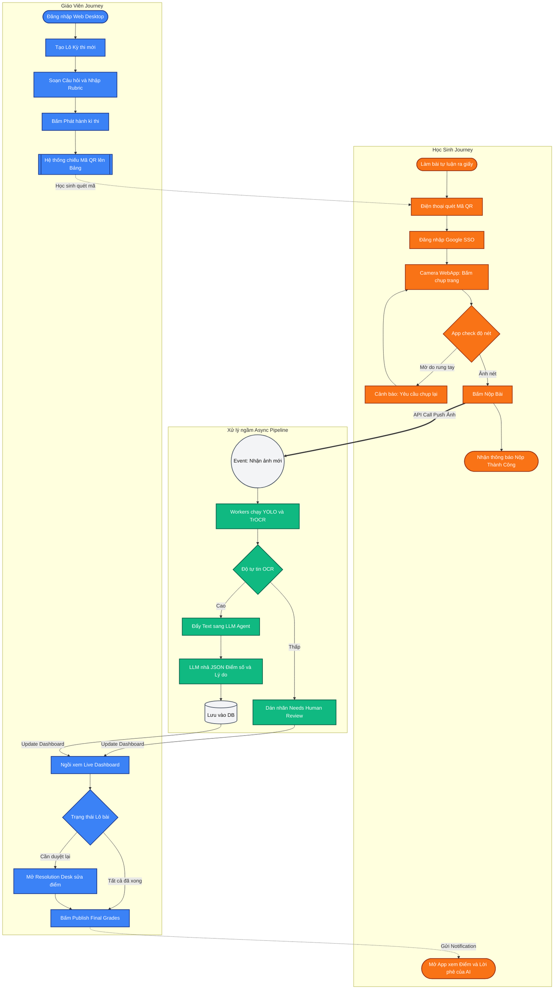

# Toàn cảnh User Flow: Hệ thống Chấm bài tự động EXAM OCR

Dưới đây là sơ đồ luồng người dùng (Userflow) chi tiết, thể hiện sự tương tác giữa Giáo viên, Học sinh và Hệ thống AI chấm điểm nền tảng (Backend).

